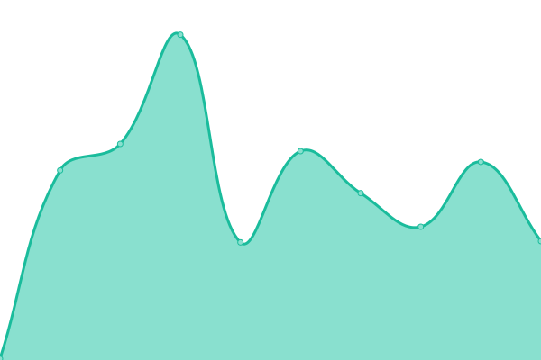
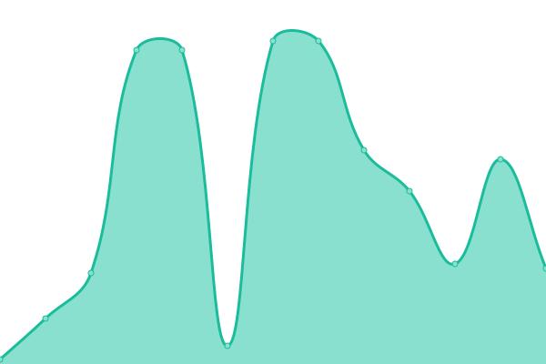
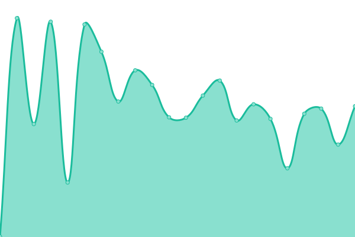
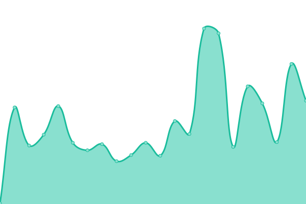

# [📈 Live Status](https://rainbowkillah.github.io/upptime): <!--live status--> **🟧 Partial outage**

This repository contains the open-source uptime monitor and status page for [De Havilland Fox](rainbowsmokeofficial.com), powered by [Upptime](https://github.com/upptime/upptime).

With [Upptime](https://upptime.js.org), you can get your own unlimited and free uptime monitor and status page, powered entirely by a GitHub repository. We use [Issues](https://github.com/rainbowkillah/upptime/issues) as incident reports, [Actions](https://github.com/rainbowkillah/upptime/actions) as uptime monitors, and [Pages](https://rainbowkillah.github.io/upptime) for the status page.

<!--start: status pages-->
<!-- This summary is generated by Upptime (https://github.com/upptime/upptime) -->
<!-- Do not edit this manually, your changes will be overwritten -->
<!-- prettier-ignore -->
| URL | Status | History | Response Time | Uptime |
| --- | ------ | ------- | ------------- | ------ |
|  [Main Domain](https://rainbowsmokeofficial.com) | 🟥 Down | [main-domain.yml](https://github.com/rainbowkillah/upptime/commits/HEAD/history/main-domain.yml) | 

 0ms
     
 | 

<a href="https://rainbowkillah.github.io/upptime/history/main-domain">0.25%</a>
    

|  [Home Network](rnbwsmk.access.ly) | 🟩 Up | [home-network.yml](https://github.com/rainbowkillah/upptime/commits/HEAD/history/home-network.yml) | 

 33ms
     
 | 

<a href="https://rainbowkillah.github.io/upptime/history/home-network">58.91%</a>
    

|  [Gravatar Profile](https://rnbwsmk.live) | 🟩 Up | [gravatar-profile.yml](https://github.com/rainbowkillah/upptime/commits/HEAD/history/gravatar-profile.yml) | 

 355ms
     
 | 

<a href="https://rainbowkillah.github.io/upptime/history/gravatar-profile">100.00%</a>
    

|  [Developer Domain](https://mrrainbowsmoke.com) | 🟩 Up | [developer-domain.yml](https://github.com/rainbowkillah/upptime/commits/HEAD/history/developer-domain.yml) | 

 111ms
     
 | 

<a href="https://rainbowkillah.github.io/upptime/history/developer-domain">100.00%</a>
    

|  [HyperPing](https://hc.hyperping.io/tok_uVjRU8AOnzH9UOGFQYX8zLFu) | 🟩 Up | [hyper-ping.yml](https://github.com/rainbowkillah/upptime/commits/HEAD/history/hyper-ping.yml) | 

 239ms
     
 | 

<a href="https://rainbowkillah.github.io/upptime/history/hyper-ping">100.00%</a>
    

<!--end: status pages-->

[**Visit our status website →**](https://rainbowkillah.github.io/upptime)

## 📄 License

- Powered by: [Upptime](https://github.com/upptime/upptime)
- Code: [MIT](./LICENSE) © [Anand Chowdhary](https://anandchowdhary.com), supported by [Pabio](https://pabio.com)
- Data in the `./history` directory: [Open Database License](https://opendatacommons.org/licenses/odbl/1-0/)
